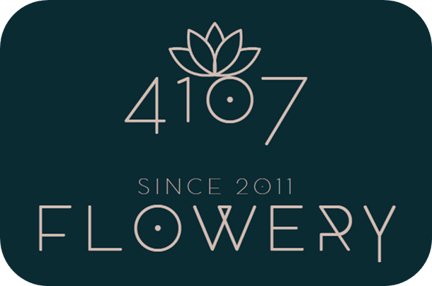

<a name="readme-top"></a>

[![Stargazers][stars-shield]][stars-url]
[![Forks][forks-shield]][forks-url]
[![Issues][issues-shield]][issues-url]
[![Winiksoft][www-shield]][www-url]
[![LinkedIn][linkedin-shield]][linkedin-url]


<!-- PROJECT LOGO -->
<br />
<div align="center">
  <a href="https://github.com/nicolasstegmann/flowery4107">
    
  </a>

<h3 align="center">4107 Flowery e-commerce site</h3>

  <p align="center">
    4107 Flowery es una empresa fundada en 2011 radicada en la ciudad de Yerba Buena (C.P. 4107 &#128540;), provincia de Tucumán que se dedica al cultivo, importación y comercialización de flores de corte, bulbos y semillas bajo el asesoramiento de <a href='https://florar.com.ar/'>Florar</a> en el área productiva.
    <br />
    En el año 2022 inició el tan esperado proceso de transformación digital con el apoyo de <a href='https://www.winiksoft.com/'>Winiksoft</a> creando su propio sitio de e-commerce.
    <br />
    <br />
    <a href="https://github.com/nicolasstegmann/flowery4107"><strong>Mira el repositorio »</strong></a>
    <br />
    <br />
    <a href="https://github.com/nicolasstegmann/flowery4107/issues">Reporta un Bug</a>
    ·
    <a href="https://github.com/nicolasstegmann/flowery4107/issues">Solicita una mejora</a>
  </p>
</div>

<details>
  <summary>Resumen del proyecto</summary>
  <ol>
    <li>
      <a href="#acerca-del-proyecto">Acerca del proyecto</a>
      <ul>
        <li><a href="#desarrollado-con">Desarrollado con</a></li>
        <li><a href="#dependencias">Dependencias</a></li>        
      </ul>
    </li>
    <li>
      <a href="#comenzando">Comenzando</a>
      <ul>
        <li><a href="#prerequisitos">Prerequisitos</a></li>
        <li><a href="#instalación">Instalación</a></li>
      </ul>
    </li>
    <li><a href="#roadmap">Roadmap</a></li>
    <li><a href="#contribuir">Contribuir</a></li>
    <li><a href="#contacto">Contacto</a></li>
  </ol>
</details>

## Acerca del proyecto

Somos unos convencidos que **una imagen vale más que mil palabras**. Enjoy it!

![Product Name Screen Shot][product-screenshot]

<p align="right">(<a href="#readme-top">volver al inicio</a>)</p>

### Desarrollado con

* [![React][React.js]][React-url]
* [![Firebase][Firebase]][Firebase-url]

<p align="right">(<a href="#readme-top">volver al inicio</a>)</p>

### Dependencias

| **Dependencia** | **Descripción** | **Version** | **Licencia** |
| -------------- | --------------- | ----------- | ----------- |
 | [reactJS](https://es.reactjs.org/docs/getting-started.html) | La biblioteca Javascript seleccionada para el desarrollo | 8.2.0 | Meta |
 | [firebase](https://console.firebase.google.com/) | Base de datos no relacional para el almacenamiento de la información | 9.14.0 | Google |
 | [formik](https://formik.org/) | Para desarrollar formularios en React de una manera más sencilla. | 2.2.9 | Formium |
 | [react-router-dom](https://reactrouter.com/en/main) | Soluciones para la navegabilidad del sitio entre las diferentes páginas | 6.4.3 | Remix  Software |
 | [react-icons](https://react-icons.github.io/react-icons/) | Para incorporar de una manera sencilla íconos al proyecto | 4.6.0 | MIT |
 | [react-toastify](https://www.npmjs.com/package/react-toastify) | Manera simple de desarrollar y amigable para el usuario de recibir notificaciones | 9.1.1 | MIT |
 | [sass](https://www.npmjs.com/package/sass) | Simplifica la manera de escribir estilos css obteniendo un código más legible y eficiente | 1.55.0 | MIT |
 | [yup](https://github.com/jquense/yup) | Librería utilizada para validar en forma sencilla campos en formularios. Perfecto aliado de formik  | 0.32.11 | MIT |
<p align="right">(<a href="#readme-top">volver al inicio</a>)</p>

## Comenzando

Si quieres una copia local del proyecto, sigue los siguientes pasos:

### Prerequisitos

Debes contar con NPM
* npm
  ```sh
  npm install npm@latest -g
  ```

### Instalación

1. Solicita las credenciales de Firestore con nuestro [Centro de soporte](mailto:support@winiksoft.com).
1. Clona el repositorio
   ```sh
   git clone https://github.com/nicolasstegmann/flowery4107.git
   ```
2. Instala los paquetes de las dependencias de NPM
   ```sh
   npm install
   ```
3. Agrega a la carpeta raíz del proyecto el archivo `.env` enviado por nuestro centro de soporte. Un ejemplo de dicho archivo sin información sensible es `.env.example`
   ```env
    REACT_APP_FIREBASE_API_KEY=TU-API_KEY
    REACT_APP_FIREBASE_AUTH_DOMAIN=TU_AUTH-DOMAIN
    REACT_APP_FIREBASE_PROJECT_ID=TU-PROJECT-ID
    REACT_APP_FIREBASE_STORAGE_BUCKET=TU-STORAGE-BUCKET
    REACT_APP_FIREBASE_MESSAGING_SENDER_ID=TU-MESSAGING-SENDER-ID
    REACT_APP_FIREBASE_APP_ID=TU-APP-ID
    REACT_APP_FIREBASE_MEASUREMENT_ID=TU-MEASUREMENT-ID
   ```

<p align="right">(<a href="#readme-top">volver al inicio</a>)</p>

<!-- ROADMAP -->
## Roadmap

- [X] Control de stock ante usuarios concurrentes antes de generar la orden
- [ ] Cuentas de usuario - Login
- [ ] Lista de deseos
- [ ] Selección de características al comprar los productos
    - [ ] Color
    - [ ] Tamaño
- [ ] Carrito persistente al cerrar el navegador
- [ ] Mis órdenes

Puedes ver aquí los [pedidos de cambio o mejora](https://github.com/nicolasstegmann/flowery4107/issues).

<p align="right">(<a href="#readme-top">volver al inicio</a>)</p>

<!-- CONTRIBUTING -->
## Contribuir

Si deseas contribuir con el proyecto, **¡bienvenido seas!**.

Si te pedimos que realices un fork del repositorio y que crees un pull request.
No te olvides de darnos una estrella. **¡Gracias nuevamente!**

1. Haz un fork del proyecto
2. Crea la rama de tu mejora (`git checkout -b mejora/tuMejora`)
3. Realiza un commit de tus cambios (`git commit -m 'Agregar algunas mejoras'`)
4. Realiza un push a la rama creada (`git push origin mejora/tuMejora`)
5. Abre un Pull Request

<p align="right">(<a href="#readme-top">volver al inicio</a>)</p>


<!-- CONTACT -->
## Contacto

Winiksoft Contact - winiksoft@winiksoft.com

Link del proyecto: [https://github.com/nicolasstegmann/flowery4107](https://github.com/nicolasstegmann/flowery4107)

<p align="right">(<a href="#readme-top">volver al inicio</a>)</p>

[stars-shield]: https://img.shields.io/github/stars/nicolasstegmann/flowery4107.svg?style=for-the-badge
[stars-url]: https://github.com/nicolasstegmann/flowery4107/stargazers
[forks-shield]: https://img.shields.io/github/forks/nicolasstegmann/flowery4107.svg?style=for-the-badge
[forks-url]: https://github.com/nicolasstegmann/flowery4107/network/members
[issues-shield]: https://img.shields.io/github/issues/nicolasstegmann/flowery4107.svg?style=for-the-badge
[issues-url]: https://github.com/nicolasstegmann/flowery4107/issues
[www-shield]: https://img.shields.io/badge/website-000000?style=for-the-badge&logo=About.me&logoColor=white
[www-url]: https://www.winiksoft.com/

[linkedin-shield]: https://img.shields.io/badge/-LinkedIn-black.svg?style=for-the-badge&logo=linkedin&colorB=555
[linkedin-url]: https://www.linkedin.com/in/nicolas-stegmann/

[product-screenshot]: src/img/4107FloweryDemo.gif

[React.js]: https://img.shields.io/badge/React-20232A?style=for-the-badge&logo=react&logoColor=61DAFB
[React-url]: https://reactjs.org/

[Firebase]: https://img.shields.io/badge/Firebase-039BE5?style=for-the-badge&logo=Firebase&logoColor=white

[Firebase-url]: https://firebase.google.com/